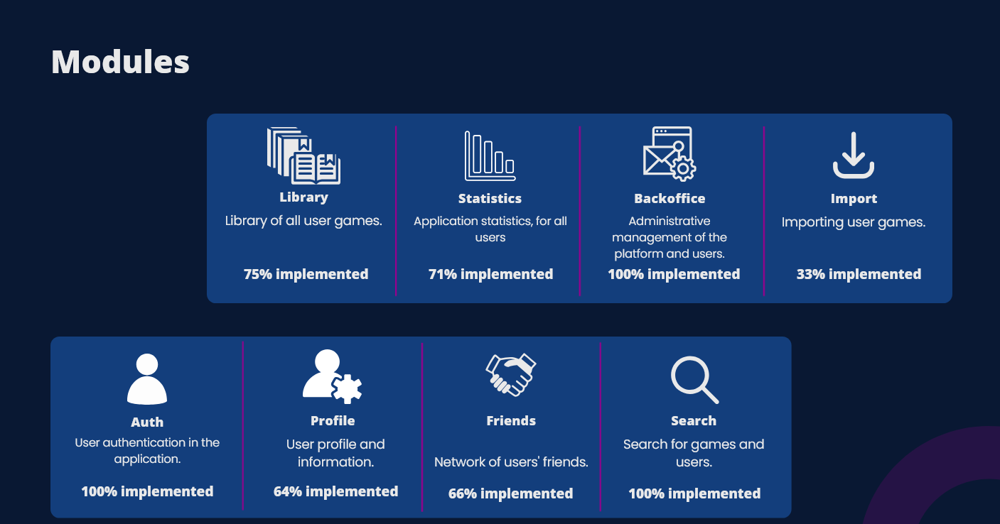
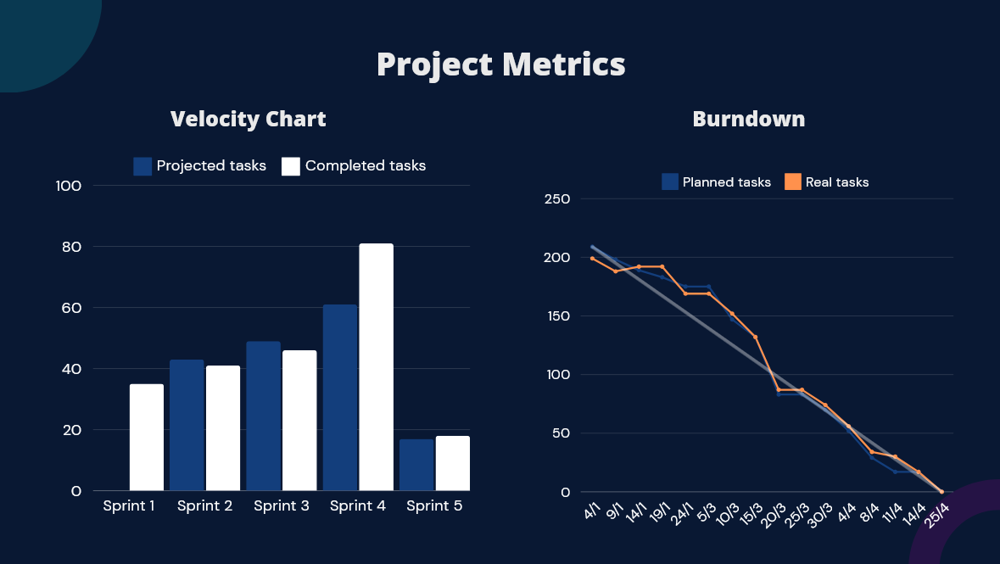

<!-- PROJECT LOGO -->

  <h3 align="center">QuestVault</h3>

  

    Video Games Backlog
     
     
    <a href="https://youtu.be/aKZYNhrAvBw">View Demo (PT)</a>
  

<!-- TABLE OF CONTENTS -->

  
Table of Contents

  <ol>
    <li>
      <a href="#about-the-project">About The Project</a>
    </li>
    <li>
      <a href="#getting-started">Modules</a>
    </li>
    <li><a href="#usage">Sprints</a></li>
    <li><a href="#roadmap">Risks</a></li>
    <li><a href="#contributing">Project Metrics</a></li>
    <li><a href="#contact">Lessons Learned</a></li>
  </ol>

<!-- ABOUT THE PROJECT -->
## About The Project

This project is a comprehensive game management platform designed to serve as a personalized game library and review system. Users can create accounts, search for games, add them to their libraries, rate and review games, and connect to their Steam accounts to import owned titles. The platform features intelligent search functionality, which automatically imports missing games from the IGDB database when necessary, storing them in a MySQL database for future access.

<!-- Modules -->
## Modules
 

<!-- Sprints -->
## Sprints
Sprint 1: focused on authentication.

Sprint 2: Focused on user profile and account settings.

Sprint 3: focused on the library module, friends and research module.

Sprint 4: Focused on the BackOffice and Statistics modules.

Sprint 5: extra focused on bug fixing and
improvements to the app design.

<!-- Risks -->
## Risks
### Planning Risks

RP1 - Inaccurate time, resource and storypoint estimates      
RP6 - Changes in project requirements during development      
RP7- Lack of time or slack in the schedule.      
RP8- Lack of contingency plans to deal with unforeseen events.     

### Development Risks
RD2- Unexpected difficulties during software development, such as complex bugs, module integration problems or limitations.      

## Project Metrics
 
<!-- Lessons Learned -->

## Lessons Learned

### Do's

Clearly define the project objectives from the beginning.
Keep the scope of the project clear and concise.
Seek feedback from all stakeholders and integrate them into project decisions.
Carry out post-delivery assessments to identify flaws and strengths.
Daily meetings to update progress and share questions.
Strict Git version control.

### Dont's

Use of the Big Bang as an integration method.
Hide doubts or uncertainties with the project.
Making unplanned changes to the project structure.
Ignore potential signs of risk or danger.
Use only verbal communication and do not consult documentation.
Change tools used during development.
Add tasks mid-sprint.
